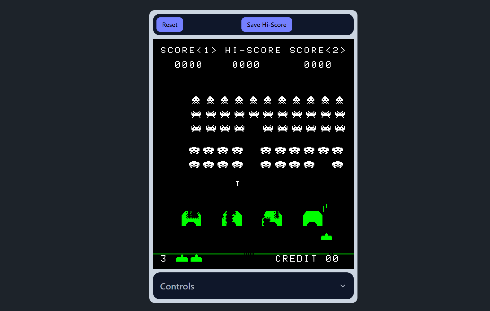

# wasm-invaders

## Overview



Wasm-invaders is a Space Invaders arcade machine emulator compiled to WebAssembly. It is developed with emscripten and emscripten SDL2 port.

### Features

**Smooth** - Emulator runs smoothly on different range of devices including smartphones (However not playable as touch controls are not present). Despite having an full emulated environment that includes emulated CPU and other peripherials that perform complex operations around million times per second, CPU usage is very low and risk of hanging the browser window is non-existent.

**High Scores Persistence** - Space Invaders rom have been reversed engineered and one of the things that came out of it is knowledge how game handles high-scores. This can be leveraged to store high scores between runs of the emulator. Wasm-invaders is capable of saving and restoring high score value using browser's Local Storage. Whenever you're done playing and you want to keep your high score for the next time, all you have to do is to click "Save Hi-Score" button at the top. On the next run of the application high score will be automatically restored from Local Storage before running the ROM.

**Authentic** - Excluding some audio quirks, emulator is pretty much identical to the original. This is because emulator runs real ROM data, the same that was used by arcade machines. Underneath wasm-invaders emulates Intel 8080 CPU, RAM Memory, Shift Register, Simple Audio Controller and Color mapping of the screen. Thus things like specific behavior of aliens or UFO that are inherent to original gameplay stay the same.

## Local Development

### Prerequisites 

- [emscripten](https://emscripten.org/docs/getting_started/downloads.html)
- [node](https://nodejs.org/en/download)
- make
- [cmake](https://cmake.org/)

### Running locally

In order to run the application locally, application must be hosted on a server, because browsers are forbidding loading wasm files from the disk.

#### Install http-server from npm

In this document, tool used to host files on a local server is a **http-server** from NPM.

```
npm install -g http-server
```

#### Build the emulator

Scripts included in the project handle things like building Cpp sources into binaries and handling NPM dependencies (like TailwindCSS used in the project).
After building all of the required files are put in the `./build` directory.

```
.\build.sh
```

#### Serve built files on a local server

Command below serves directory with built files at port 8080.

```
http-server ./build -p8080 -c-1
```

#### Open application in web browser

Open *localhost:8080* in web browser
