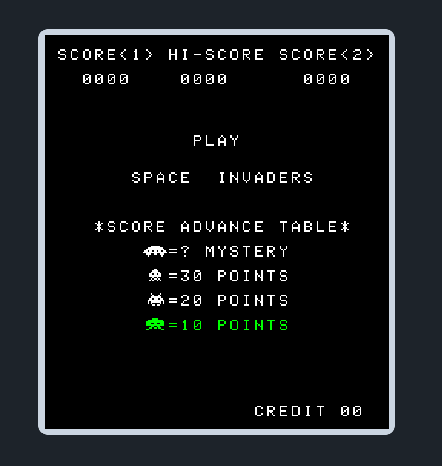

# wasm-invaders

## Description

Space invaders emulator compiled to WebAssembly.



## Controls

- **C** - Insert Coin
- **1** - Select 1 Player
- **2** - Select 2 Players

- **W** - Player 1 Shoot
- **A** - Player 1 Left
- **D** - Player 1 Right

- **↑** - Player 2 Shoot
- **←** - Player 2 Left
- **→** - Player 2 Right

## How to run

Prequisites:
- emscripten
- node
- make
- cmake

**Install http-server from npm**

```
npm install -g http-server
```

**Build the emulator**

```
.\build
```

**Serve built files on a local server**

```
http-server build
```

**Open application in web browser**

Open *localhost:8080* in web browser